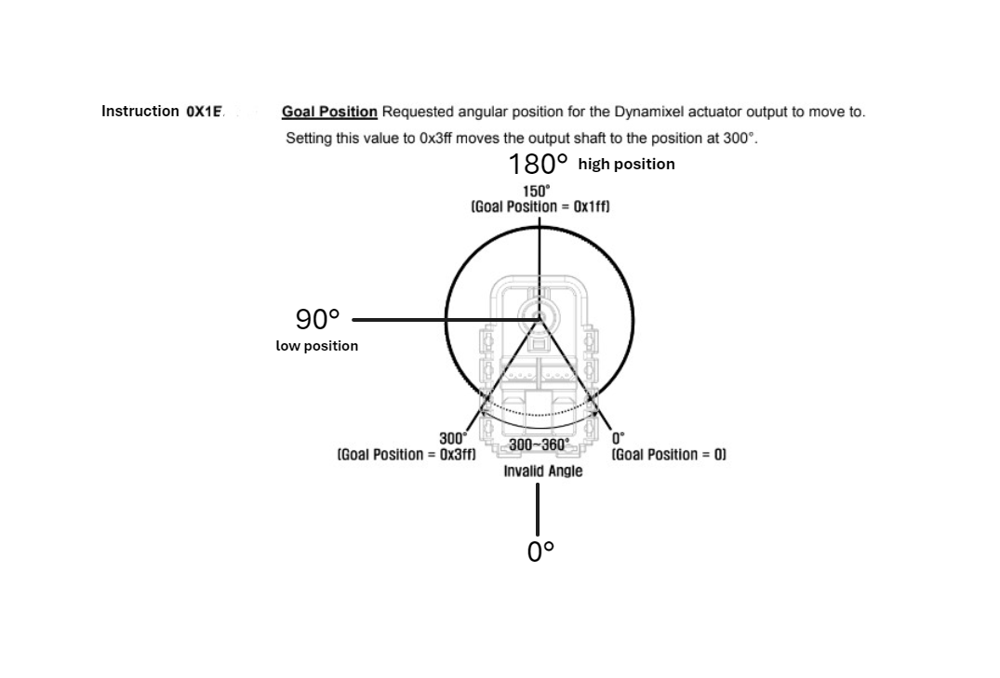

# Arduino

Consider the following setup: an Arduino Uno board is connected to a servomotor via the Serial port and to a joystick lever on pin A2. The task is to program the Arduino board to control the position of the motor based on the position of the joystick: when the joystick is in its lowest position, the motor should also be in its lowest position, and vice versa.

## Communication protocol

To communicate with the servomotor, the Arduino board opens a serial connection with a baud rate of 19200 baud and uses the following protocol: it sends a byte representing an instruction followed by the argument of that instruction on 2 bytes.

The instruction code to move the servomotor to a set position can be found in the following image (from the motor's datasheet), along with the range of positions that the motor must be limited to, and the codec to represent them.

The board should sample the value of the joystick every 100 ms. The joystick outputs its minimum voltage when in its lowest position and its maximum voltage when in its highest position.

## Testing your solution

Write a complete Arduino sketch, named `MotorArduino.ino` which implements the control of the servomotor.

To test your sketch, we've provided an implementation of some Arduino functions, which can be found inside the `lib` folder. Ensure you have the necessary environment set up:
- a POSIX environment
- the gcc/g++ compiler
- Make for building the executable

For Windows users, we recommend using WSL (Windows Subsystem for Linux) or a Linux virtual machine.

To compile your sketch, run `make` in the directory containing the `makefile`. This will produce an executable called `motorMain`, which simulates running your `MotorArduino.ino` sketch on a real Arduino board.

If your solution doesn't meet any of the requirements, the program will crash immediately. Otherwise, it will ouput the position that the motor has been instructed to reach by your code. The correct solution will produce the following positions: 818, 818, 818, 788, 758, 743, 728, 665, 593, 511, 511, 511, 511, 593, 638, 668, 758, 788, 818, 818...

If you obtain different positions, consider reviewing the mapping of the joystick's positions to the positions of the motor. If you cannot figure this out, submit your solution anyways as it's already pretty close to the correct one.

### Important notes

Pay attention to the size in bytes of different `int` types and to the different overloads of the `Serial.write()` function (if used).

Our virtual Arduino does not implement all functions available for a real Arduino board. If the solution you come up with involves some functions that we haven't implemented but works on a real Arduino, it will obviously be considered as valid. Bonus points if you implement the missing functions in our `FakeArduino` code.

Note that the `Serial.print()` function is not implemented in our virtual Arduino. For debugging purposes, you can use standard C/C++ `printf`, even though it wouldn't normally be available for Arduino.

