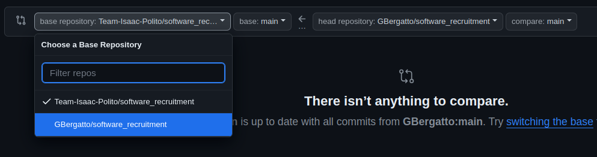

# Software Area recruiment

The repository contains three questions covering the following topics, each organized into separate folders:

- Arduino
- Docker
- ROS2 + Python

Each question is detailed in the `README.md` file within its respective folder.

Attempt to solve as many questions as you can, even if you're not very familiar with a particular topic. Feel free to consult documentation online.

To submit your answers, follow these steps:

1. Fork our repository.
2. Create a new branch named `solution`.
3. Edit and create all files required to answer the questions.
4. Open a pull request against the `main` branch of your own fork.
5. Paste the link to this pull request in the text box provided.

**Note:** Do not open a pull request against [our repository](https://github.com/Team-Isaac-Polito/software_recruitment) to avoid disclosing your solution to other candidates.

