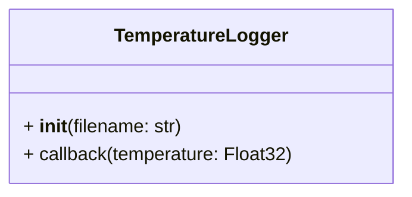

# Temperature Logger

Our robot is primarily constructed from PLA, a commonly used 3D printing material. PLA softens at approximately 50°C, and prolonged exposure to temperatures higher than this can lead to deformation.

To monitor potential damage to the robot's chassis, we need to log every instance when the robot's temperature reaches or exceeds 50°C. The log should include the time of the event and the measured temperature.

The high-level code controlling our robot is primarily written in Python and utilizes ROS2 (Robot Operating System).

## What is ROS2?

If you're unfamiliar with ROS2, you can learn more about it from the following links:
1. [How to install ROS2 on Ubuntu 22.04](https://docs.ros.org/en/iron/Installation/Ubuntu-Install-Debians.html)
2. [Basic Concepts](https://docs.ros.org/en/iron/Concepts/Basic.html): focus only on Nodes and Topics
3. [Using colcon to build packages](https://docs.ros.org/en/iron/Tutorials/Beginner-Client-Libraries/Colcon-Tutorial.html)
4. [Creating a workspace](https://docs.ros.org/en/iron/Tutorials/Beginner-Client-Libraries/Creating-A-Workspace/Creating-A-Workspace.html)
5. [Creating a package](https://docs.ros.org/en/iron/Tutorials/Beginner-Client-Libraries/Creating-Your-First-ROS2-Package.html)
6. [Writing a simple publisher and subscriber (Python)](https://docs.ros.org/en/iron/Tutorials/Beginner-Client-Libraries/Writing-A-Simple-Py-Publisher-And-Subscriber.html)

While other setups are possible, we highly recommend installing ROS2 on Ubuntu Jammy (22.04). If Ubuntu Jammy isn't your main operating system, you can install it on a virtual machine or any other environment you're comfortable with.

ROS2 comes in various distributions, known as [distributions](https://docs.ros.org/en/iron/Releases.html). Currently, our robot runs on the [Humble distribution](https://docs.ros.org/en/iron/Releases/Release-Humble-Hawksbill.html), but you can also use [Iron](https://docs.ros.org/en/iron/Releases/Release-Iron-Irwini.html) as they are mostly the same for the scope of this challenge. All links provided in this document refer to `Iron`, but you can easily select another version from the menu in the bottom-left corner of the documentation.

## Task Description

In the `ROS2` folder you will find a workspace that contains a package called `reseq`. Within it, you can find two nodes:
- `TemperatureSensor`: simulates a sensor that publishes temperature values between 0 and 100°C at a set time interval (already implemented)
- `TemperatureLogger`: logs any temperature greater than 50°C, as described above

### First task: implementing TemperatureLogger Node

Your first task is to implement the `TemperatureLogger` node by completing the `temperature_logger.py` file. Below is a basic class diagram to guide you:

Feel free to add any additional attributes and methods as needed and import any required Python packages.

### Second task: writing a Launch File

To facilitate the configuration and execution of multiple ROS2 nodes, launch files are used. Learn more about them [here](https://docs.ros.org/en/iron/Concepts/Basic/About-Launch.html) and [here](https://docs.ros.org/en/iron/Tutorials/Intermediate/Launch/Creating-Launch-Files.html#ros2-launch).

Your second task is to implement such a launch file that starts both nodes (`TemperatureLogger` and `TemperatureSensor`) in the `reseq` package. Ensure to place the launch file in the correct folder.

## Important note

While it is technically possible to complete the challenge without installing ROS2 if you choose not to test your solution, we strongly advise going through the installation process.

By doing so, you'll have a working setup in place, which will allow you to start contributing right away if you were to join the team. If not, you will still have gained some valuable experience with an extremely popular technology in the field of robotics.

In addition, the fact that you're willing to go through an installation process shows dedication, which is one of the main attributes we are looking for in new members. Simply completing the ROS2 installation will be more highly regarded than submitting a flawless but untested solution to the task.

